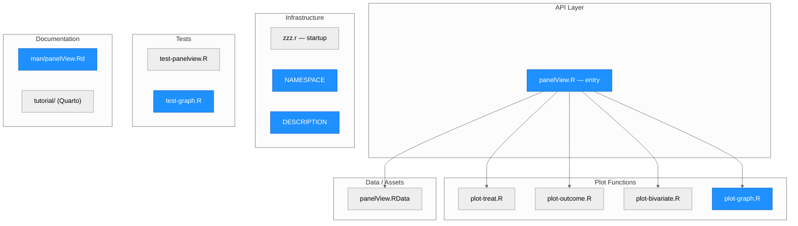
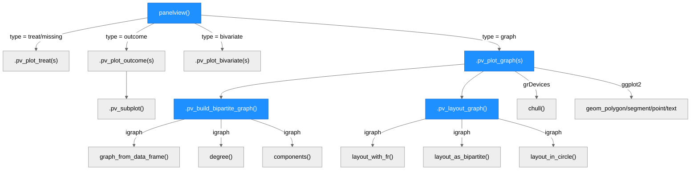
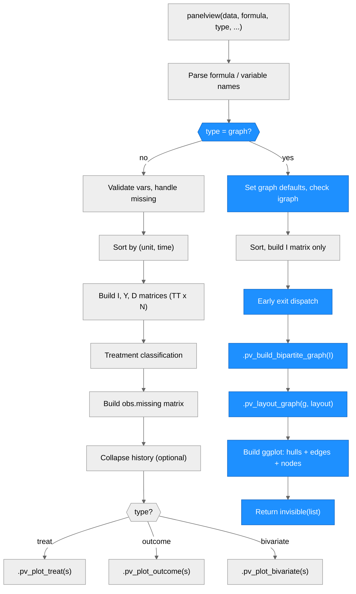

# Architecture — panelView

> Generated by scriber for run `REQ-bipartite-graph-20260321-125712` on 2026-03-21.

## Overview

panelView is an R package for visualizing panel (time-series cross-sectional) data. It provides four main functionalities: (1) treatment status and missing value heatmaps, (2) outcome temporal dynamics plots, (3) bivariate treatment-outcome relationship plots, and (4) bipartite graph visualization of panel structure. The package exports a single function, `panelview()`, which accepts approximately 56 parameters and dispatches internally to one of four specialized plot functions. panelView was published in the Journal of Statistical Software (doi:10.18637/jss.v107.i07). Authors: Hongyu Mou, Licheng Liu, and Yiqing Xu. Current version: 1.2.1.

---

## Module Structure

### Module Reference

| Module / File | Layer | Purpose | Key Exports / Functions | Changed |
| --- | --- | --- | --- | --- |
| `R/panelView.R` | API | Entry point: input parsing, validation, data reshaping, dispatch (~1200 lines) | `panelview()` (exported) | **yes** |
| `R/plot-treat.R` | Plot | Treatment status / missing value heatmap (~340 lines) | `.pv_plot_treat()` | no |
| `R/plot-outcome.R` | Plot | Outcome time-series plots (~1000 lines) | `.pv_plot_outcome()`, `.pv_subplot()` | no |
| `R/plot-bivariate.R` | Plot | Dual-axis treatment + outcome plots (~430 lines) | `.pv_plot_bivariate()` | no |
| `R/plot-graph.R` | Plot | Bipartite graph visualization (~300 lines) | `.pv_build_bipartite_graph()`, `.pv_layout_graph()`, `.pv_plot_graph()` | **yes** (new) |
| `R/zzz.r` | Infra | `.onAttach()` startup message | — | no |
| `data/panelView.RData` | Data | Bundled datasets: simdata, turnout, capacity | — | no |
| `man/panelView.Rd` | Docs | Rd documentation for `panelview()` | — | **yes** |
| `DESCRIPTION` | Infra | Package metadata (v1.2.1) | — | **yes** |
| `NAMESPACE` | Infra | Export + imports | — | **yes** |
| `tests/testthat/test-panelview.R` | Test | Existing test suite (36 tests) | — | no |
| `tests/testthat/test-graph.R` | Test | Graph visualization tests (64 assertions) | — | **yes** (new) |
| `tutorial/` | Docs | Quarto book (chapters: treat, outcome, bivariate, changelog) | — | no |

---

## Function Call Graph

### Function Reference

| Function | Defined In | Called By | Calls | Changed | Purpose |
| --- | --- | --- | --- | --- | --- |
| `panelview()` | `R/panelView.R` | user (exported) | `.pv_plot_treat`, `.pv_plot_outcome`, `.pv_plot_bivariate`, `.pv_plot_graph` | **yes** | Single entry point: parse inputs, build I matrix, dispatch to plotter |
| `.pv_plot_treat()` | `R/plot-treat.R` | `panelview` | ggplot2 | no | Treatment status / missing value heatmap |
| `.pv_plot_outcome()` | `R/plot-outcome.R` | `panelview` | `.pv_subplot`, ggplot2, gridExtra | no | Outcome time-series plots |
| `.pv_subplot()` | `R/plot-outcome.R` | `.pv_plot_outcome` | ggplot2 | no | Helper for outcome subplots |
| `.pv_plot_bivariate()` | `R/plot-bivariate.R` | `panelview` | ggplot2 | no | Dual-axis bivariate plot |
| `.pv_plot_graph()` | `R/plot-graph.R` | `panelview` | `.pv_build_bipartite_graph`, `.pv_layout_graph`, igraph, ggplot2, grDevices | **yes** (new) | Bipartite graph visualization with component hulls and singleton highlights |
| `.pv_build_bipartite_graph()` | `R/plot-graph.R` | `.pv_plot_graph` | igraph | **yes** (new) | Construct igraph bipartite graph from observation indicator matrix I |
| `.pv_layout_graph()` | `R/plot-graph.R` | `.pv_plot_graph` | igraph | **yes** (new) | Compute 2D layout coordinates via FR/bipartite/circle algorithms |

---

## Data Flow

---

## Architectural Patterns

- **Single-function API**: The package exports only `panelview()`. All complexity is hidden behind approximately 56 parameters. This provides a simple, discoverable interface at the cost of a large monolithic entry function.
- **Environment-list dispatch**: The entire local environment is captured as a list (`s <- as.list(environment())`) and passed to each plotter. Plotters unpack via `with(s, {...})` (existing types) or explicit extraction (graph type). This avoids maintaining parallel parameter lists.
- **Early-exit for graph type**: The graph type short-circuits after I matrix construction, bypassing all treatment processing, obs.missing construction, and collapse-history logic. This keeps the graph path clean and avoids interacting with code irrelevant to graph visualization.
- **Conditional dependency**: igraph is in Suggests (not Imports), loaded via `requireNamespace()` with a clear install message. All igraph calls use `igraph::` prefix. This keeps the package lightweight for users who do not need graph visualization.
- **Internal function prefix convention**: All plot functions use the `.pv_` prefix (e.g., `.pv_plot_graph`, `.pv_build_bipartite_graph`), making them clearly internal and non-exported.
- **Bipartite graph from panel data**: The observation indicator matrix I (TT x N) is naturally a bipartite incidence matrix. Units and time periods form disjoint node sets; edges represent observations. This reveals structural properties (connectivity, singletons) relevant to fixed-effect identification (Correia 2016).

---

## Dependencies

| Package | Role | Key functions used |
| --- | --- | --- |
| ggplot2 (>= 3.4.0) | Core plotting engine | `ggplot`, `geom_tile`, `geom_line`, `geom_point`, `geom_col`, `geom_jitter`, `geom_ribbon`, `geom_bar`, `geom_rect`, `geom_boxplot`, `geom_density`, `geom_segment`, `geom_polygon`, `geom_text`, `scale_*_manual`, `facet_wrap`, `sec_axis`, `theme`, `guides` |
| gridExtra | Multi-panel layout | `grid.arrange`, `arrangeGrob` |
| grid | Text annotations for panel titles | `textGrob`, `gpar` |
| dplyr (>= 1.0.0) | Collapse-history grouping | `coalesce`, `summarise`, `group_by`, `across`, `everything`, `n` |
| stats (base) | Data utilities | `na.omit`, `sd`, `var`, `ave`, `aggregate`, `approxfun` |
| grDevices (base) | Convex hull computation | `chull` |
| igraph (Suggests) | Bipartite graph construction and analysis | `graph_from_data_frame`, `degree`, `components`, `layout_with_fr`, `layout_as_bipartite`, `layout_in_circle`, `as_edgelist`, `vcount`, `ecount`, `is_bipartite` |

**Why ggplot2 >= 3.4.0**: The package uses `linewidth` (introduced in ggplot2 3.4.0) instead of the deprecated `size` parameter for line geoms.

**Suggests**: `testthat (>= 3.0.0)` for testing, `igraph` for bipartite graph visualization.

---

## Notes

- The graph type adds 6 new parameters to `panelview()`, bringing the total to approximately 56. These parameters are only used when `type = "graph"` and are ignored otherwise.
- The FR (Fruchterman-Reingold) layout is non-deterministic across runs. Visual tests should check structural properties, not exact coordinates.
- Component hull colors recycle after 8 distinct components. Panels with many components will see repeated colors.
- A single-observation panel (1 unit, 1 time) required a special guard around the time-gap calculation to avoid division by zero. The graph type bypasses this block entirely.
