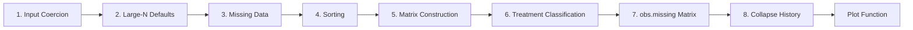
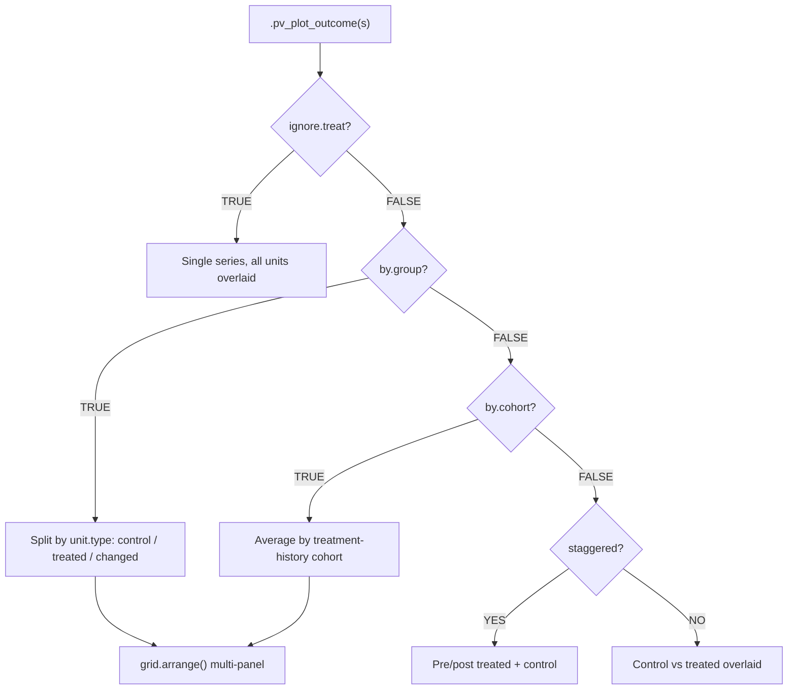

# ARCHITECTURE.md — panelView

## Overview

panelView is an R package for visualizing panel (time-series cross-sectional) data. It provides three main functionalities: (1) treatment status and missing value heatmaps, (2) outcome temporal dynamics plots, and (3) bivariate treatment-outcome relationship plots. The package exports a single function, `panelview()`, which accepts approximately 50 parameters and dispatches internally to one of three specialized plot functions. panelView was published in the Journal of Statistical Software (doi:10.18637/jss.v107.i07). Authors: Hongyu Mou, Licheng Liu, and Yiqing Xu. Current version: 1.2.1.

## File Structure

```
panelView/
├── R/
│   ├── panelView.R        — Entry point: input parsing, validation, data reshaping, dispatch (~1160 lines)
│   ├── plot-treat.R        — .pv_plot_treat(): treatment status / missing value heatmap (~340 lines)
│   ├── plot-outcome.R      — .pv_plot_outcome() + .pv_subplot(): outcome time-series plots (~1000 lines)
│   ├── plot-bivariate.R    — .pv_plot_bivariate(): dual-axis treatment + outcome plots (~430 lines)
│   └── zzz.r               — .onAttach() startup message (~5 lines)
├── data/
│   └── panelView.RData     — Bundled datasets: simdata, turnout, capacity
├── man/                     — Rd documentation files
├── tests/
│   ├── testthat.R           — Test runner
│   └── testthat/            — Test suite
├── tutorial/                — Quarto book (chapters: treat, outcome, bivariate, changelog)
│   ├── index.qmd
│   ├── 01-treat.Rmd
│   ├── 02-outcome.Rmd
│   ├── 03-bivariate.Rmd
│   ├── aa-changelog.Rmd
│   ├── _quarto.yml
│   └── references.bib
├── DESCRIPTION              — Package metadata (v1.2.1)
├── NAMESPACE                — Single export: panelview; imports from ggplot2, gridExtra, grid, dplyr, stats
└── LICENSE                  — MIT license
```

## Entry Point and Dispatch

`panelview()` is the only exported function. It accepts a data frame in long form along with approximately 50 parameters controlling variable selection, plot type, appearance, and behavior.

### Formula Parsing

The function supports two interfaces for specifying variables:

- **Formula interface**: `panelview(data, Y ~ D + X1 + X2, index = c("unit", "time"))` — left side is the outcome, first right-side variable is the treatment, remaining variables are covariates.
- **Explicit variable names**: `panelview(data, Y = "y", D = "d", index = c("unit", "time"))`.
- **Special case**: `Y ~ 1` specifies no treatment variable; the function sets `ignore.treat = TRUE`.

### Type Normalization

The `type` parameter uses `match.arg()` for partial matching. Recognized values and aliases:

- `"treat"` — treatment status heatmap
- `"missing"` (alias `"miss"`) — internally converts to `type = "treat"` with `ignore.treat = 1`
- `"outcome"` (alias `"raw"`) — outcome time-series plot
- `"bivariate"` (alias `"bivar"`) — dual-axis treatment + outcome plot

### Dispatch Mechanism

After all input parsing, validation, and data reshaping, the function captures its entire local environment as a list and routes to the appropriate plot function:

```r
s <- as.list(environment())
if (type == "outcome") {
    .pv_plot_outcome(s)
} else if (type == "treat") {
    .pv_plot_treat(s)
} else if (type == "bivariate") {
    .pv_plot_bivariate(s)
}
```

Each plot function receives the full state via `s` and unpacks it with `with(s, { ... })`. This avoids maintaining parallel parameter lists across functions — each plotter has access to all variables computed during the data processing phase.

### Flow Diagram

```mermaid
flowchart TD
    A["panelview(data, formula, type, ...)"] --> B[Parse formula / explicit variable names]
    B --> C[Validate inputs]
    C --> D[Reshape data to TT × N matrices]
    D --> E[Construct obs.missing matrix]
    E --> F["s ← as.list(environment())"]
    F --> G{type?}
    G -->|"treat" / "missing"| H[".pv_plot_treat(s)"]
    G -->|"outcome"| I[".pv_plot_outcome(s)"]
    G -->|"bivariate"| J[".pv_plot_bivariate(s)"]
```

## Data Processing Pipeline

Raw input data passes through eight stages before reaching a plot function.



### Stage 1: Input Coercion

The data argument is coerced to a plain `data.frame` if it has multiple classes (e.g., tibble). Factor unit IDs are inspected: if the factor levels are numeric strings they are converted to numeric; otherwise they are converted to character.

### Stage 2: Large-N Defaults

When the number of unique units N exceeds 500, the function applies adaptive defaults:

- `collapse.history` is set to `TRUE` for treatment plots (groups units by identical treatment sequences).
- Unless `display.all = TRUE`, a random sample of 500 units is drawn for display.
- Grid lines are auto-disabled when N exceeds 300.

### Stage 3: Missing Data Handling

Two modes controlled by the `leave.gap` parameter:

- `leave.gap = FALSE` (default): `na.omit()` drops all rows with any missing values.
- `leave.gap = TRUE`: The panel is expanded to a balanced grid using `expand.grid()` + `merge()`, filling gaps with NA. Units that are entirely missing are dropped.

### Stage 4: Sorting

Data is sorted by `(unit_id, time)` to ensure correct matrix reshaping.

### Stage 5: Panel Balancing and Matrix Construction

Long-form data is reshaped into TT x N matrices (where TT = number of time periods, N = number of units):

- `Y` — outcome matrix
- `D` — treatment matrix
- `I` — observation indicator matrix (1 = observed, 0 = missing)

### Stage 6: Treatment Classification

For binary treatment (`d.bi = TRUE`):

- A cumulative sum (`cumsum`) is applied column-wise to enforce the "once treated, always treated" assumption. The original treatment matrix is preserved in `D.old` for plots that need reversal information.
- `T0` — first treatment period per unit.
- `T1` — treatment duration.
- `staggered` — whether treatment timing varies across units (vs. simultaneous).
- `DID` — whether all treated units receive treatment at the same time.
- `unit.type` — classification of each unit: 1 = always control, 2 = always treated, 3 = treatment status changed (reversal).

### Stage 7: obs.missing Matrix Construction

A unified integer-coded matrix consumed by all plot types:

| Code | Meaning |
|------|---------|
| `-200` | Missing observation |
| `-1` | Under control (or observed, when treatment is ignored) |
| `0` | Treated, pre-treatment period |
| `1` | Treated, post-treatment period |

For non-binary treatment with more than 2 levels, actual treatment level values are stored. Missing observations are coded as NA or -200. The sentinel value -200 was chosen to be far from any valid treatment level.

### Stage 8: Collapse History (Optional)

When `collapse.history = TRUE`, units are grouped by identical treatment sequences using `dplyr::group_by(across(everything()))`. The unit dimension is replaced by unique-history counts, sorted by cohort size in descending order. This reduces visual clutter in large panels.

## Plot Type Catalog

### Treatment Status Plot (`type = "treat"`)

- **Function**: `.pv_plot_treat()` in `plot-treat.R`
- **Visualization**: Heatmap using `geom_tile()` where each cell represents a unit-period.
- **Color schemes**:
  - Binary treatment: `#B0C4DE` (light steel blue) = controls, `#4671D5` (medium blue) = treated pre-treatment, `#06266F` (dark blue) = treated post-treatment, `#FFFFFF` (white) = missing.
  - Multi-level discrete treatment: Palette of 12 colors starting with `#66C2A5`, `#FC8D62`, `#8DA0CB`, etc.
  - Continuous treatment: Bins into 4 intervals with a blue gradient from `#c6dbef` to `#042b53`.
- **Key features**:
  - `by.timing = TRUE` sorts treated units by treatment timing (T0).
  - `collapse.history = TRUE` collapses to unique treatment histories with unit counts as y-axis labels.
  - `pre.post = TRUE` distinguishes pre/post periods for treated units.
  - `ignore.treat = TRUE` or `type = "missing"` shows only observed vs. missing.
  - Unit labels are auto-hidden when N >= 200.
  - Grid lines controlled by `gridOff`.

### Outcome Plot (`type = "outcome"`)



- **Functions**: `.pv_plot_outcome()` and helper `.pv_subplot()` in `plot-outcome.R`
- **Visualization**: Time-series line plots (continuous outcome) or jitter plots (discrete outcome).
- **Sub-modes**:
  - `ignore.treat = TRUE`: Single series with all units overlaid in grey.
  - `ignore.treat = FALSE, by.group = FALSE`: Mixed plot with control and treated overlaid. Staggered DID distinguishes pre/post treated.
  - `by.group = TRUE`: Separate subplots for "Always Under Control", "Always Under Treatment", "Treatment Status Changed" (uses `unit.type`).
  - `by.group.side = TRUE`: Arranges subplots horizontally instead of vertically.
  - `by.cohort = TRUE`: Averages outcome by treatment-history cohort (maximum 20 cohorts).
- **Color defaults**: Grey (`#5e5e5e50`) for control, salmon/red (`#FC8D62`, `red`) for treatment.
- **Multi-panel layout**: Uses `gridExtra::grid.arrange()` with a shared legend extracted via `ggplotGrob()`.
- **Treatment timing**: Vertical white line at treatment onset for DID data; optional shading via `shade.post`.

### Bivariate Plot (`type = "bivariate"`)

- **Function**: `.pv_plot_bivariate()` in `plot-bivariate.R`
- **Visualization**: Dual-axis plot showing outcome (primary y-axis) and treatment (secondary y-axis) over time.
- **Style selection**: The `style` parameter controls the geom for each variable: `"l"` (line), `"b"` (bar), `"c"` (connected = line + points). Default style depends on the treatment/outcome type combination (e.g., discrete treatment + continuous outcome defaults to bar + line).
- **Axis scaling**: Uses a linear transformation (`coeff`) computed by solving a 2x2 system to map treatment values onto the outcome axis range.
- **Sub-modes**:
  - `by.unit = FALSE` (default): Plots aggregate means across all units.
  - `by.unit = TRUE`: Faceted by unit using `facet_wrap(~input.id, ncol = 4)`.
- **Color defaults**: `"dodgerblue4"` and `"lightsalmon2"` (or black/grey when `theme.bw = TRUE`).

## Key Design Decisions

1. **Single-function API**: The package exports only `panelview()`. All complexity is hidden behind approximately 50 parameters. This provides a simple, discoverable interface for users at the cost of a large monolithic entry function.

2. **Environment-list dispatch pattern**: Instead of passing individual arguments to plot functions, the entire local environment is captured as a list (`s <- as.list(environment())`) and passed to each plotter. Plotters unpack via `with(s, {...})`. This avoids maintaining parallel parameter lists across four functions, but means each plotter has access to all variables, not just those it needs.

3. **Monolith split into four files**: The original monolithic function was split into `panelView.R` (entry + data processing) and three plot-type files. Each file contains exactly one internal function (plus the `.pv_subplot` helper in plot-outcome.R). This separation makes the plot logic easier to maintain independently.

4. **obs.missing unified encoding**: A single integer-coded matrix (-200, -1, 0, 1) represents all observation states. This simplifies color mapping and legend construction across plot types. The sentinel value -200 is chosen to be far from valid treatment levels.

5. **"Once treated, always treated" enforcement**: For binary treatment, `cumsum()` is applied column-wise to the D matrix, converting any treatment reversal into permanent treatment. The original D is preserved in `D.old` for plots that need reversal information.

6. **Collapse history for large panels**: For N > 500, units are grouped by treatment sequence to reduce visual clutter. The count of units per group is displayed as the y-axis label.

7. **Auto-adaptation for large panels**: The package automatically adjusts for large N: disables grid lines (N > 300), samples 500 units (N > 500), enables collapse.history (N > 500 for treat plots), and hides unit labels (N >= 200).

## Dependencies

| Package | Role | Key functions used |
|---------|------|--------------------|
| ggplot2 (>= 3.4.0) | Core plotting engine | `ggplot`, `geom_tile`, `geom_line`, `geom_point`, `geom_col`, `geom_jitter`, `geom_ribbon`, `geom_bar`, `geom_rect`, `geom_boxplot`, `geom_density`, `scale_*_manual`, `facet_wrap`, `sec_axis`, `theme`, `guides` |
| gridExtra | Multi-panel layout | `grid.arrange`, `arrangeGrob` |
| grid | Text annotations for panel titles | `textGrob`, `gpar` |
| dplyr (>= 1.0.0) | Collapse-history grouping | `coalesce`, `summarise`, `group_by`, `across`, `everything`, `n` |
| stats (base) | Data utilities | `na.omit`, `sd`, `var`, `ave`, `aggregate`, `approxfun` |

**Why ggplot2 >= 3.4.0**: The package uses `linewidth` (introduced in ggplot2 3.4.0) instead of the deprecated `size` parameter for line geoms.

**Suggests**: `testthat (>= 3.0.0)` for testing.
